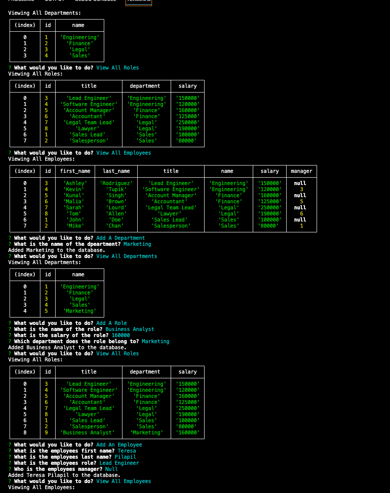

# EMPLOYEE DATABASE TRACKER

## Description
A command line application to manage a company's employee database.

[A deployed version can be viewed here.](None)

---
## Table of Contents
1. [Usage](#about)
     * [User Story](#userStory)
     * [Acceptance criteria](#acceptanceCriteria)
     * [Visuals](#visuals)
     * [Build](#build)
2. [Installation](#installation)
3. [License](#license)
4. [Contributing](#contributing)
5. [Tests](#tests)
6. [Authors and acknowledgment](#authors%20and%20acknowledgment)
---
## About
#### This project uses node.js, inquirer and mySQL.
---
## User Story
#### I WANT to be able to view and manage the departments, roles, and employees in my company SO THAT I can organize and plan my business
---
## Acceptance Criteria
#### GIVEN a command-line application that accepts user input
WHEN I start the application
THEN I am presented with the following options: view all departments, view all roles, view all employees, add a department, add a role, add an employee, and update an employee role

WHEN I choose to view all departments

THEN I am presented with a formatted table showing department names and department ids

WHEN I choose to view all roles

THEN I am presented with the job title, role id, the department that role belongs to, and the salary for that role

WHEN I choose to view all employees

THEN I am presented with a formatted table showing employee data, including employee ids, first names, last names, job titles, departments, salaries, and managers that the employees report to

WHEN I choose to add a department

THEN I am prompted to enter the name of the department and that department is added to the database

WHEN I choose to add a role

THEN I am prompted to enter the name, salary, and department for the role and that role is added to the database

WHEN I choose to add an employee

THEN I am prompted to enter the employee’s first name, last name, role, and manager, and that employee is added to the database

WHEN I choose to update an employee role

THEN I am prompted to select an employee to update and their new role and this information is updated in the database

---
## Screenshot

---
## Installation:
1. Download the script from github. 
2. run mysql from your cli. 
3. Run source schema.sql. 
4. Run seeds.sql 
5. Quit mySQL. 
6. Run npm install. 
7. Run node index.js.

To clone the repo:

    git clone git@github.com:teresagithub17/employeeDatabase.git

---

## Contributing

To contribute to this application, create a pull request.
Here are the steps needed for doing that:
- Fork the repo
- Create a feature branch (git checkout -b NAME-HERE)
- Commit your new feature (git commit -m 'Add some feature')
- Push your branch (git push)
- Create a new Pull Request
Following a code review, your feature will be merged.
---
## Tests
* None
---
## Authors and Acknowledgments
* Teresa
---
## Contact Information
If you have further questions please reach out to the following contact information:
* GitHub Username: teresagithub17
* GitHub Email: teresa.pilapil@gmail.com

